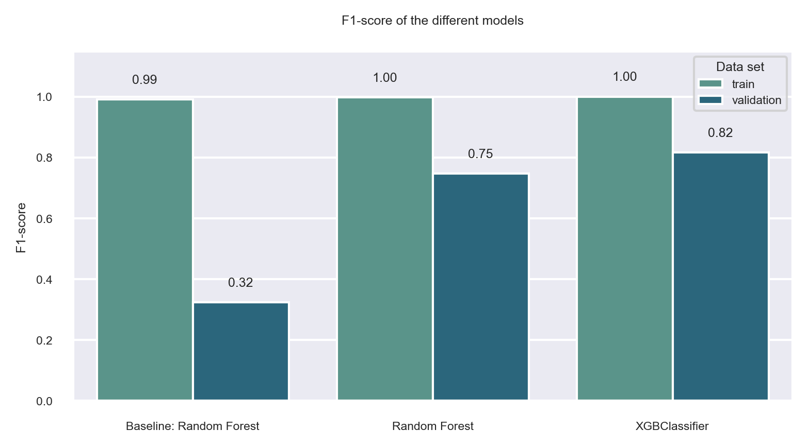
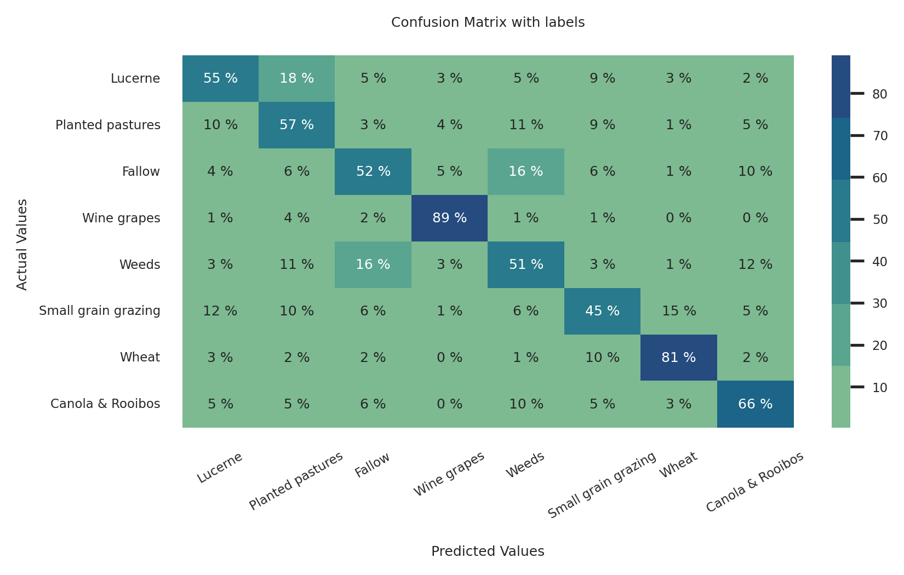
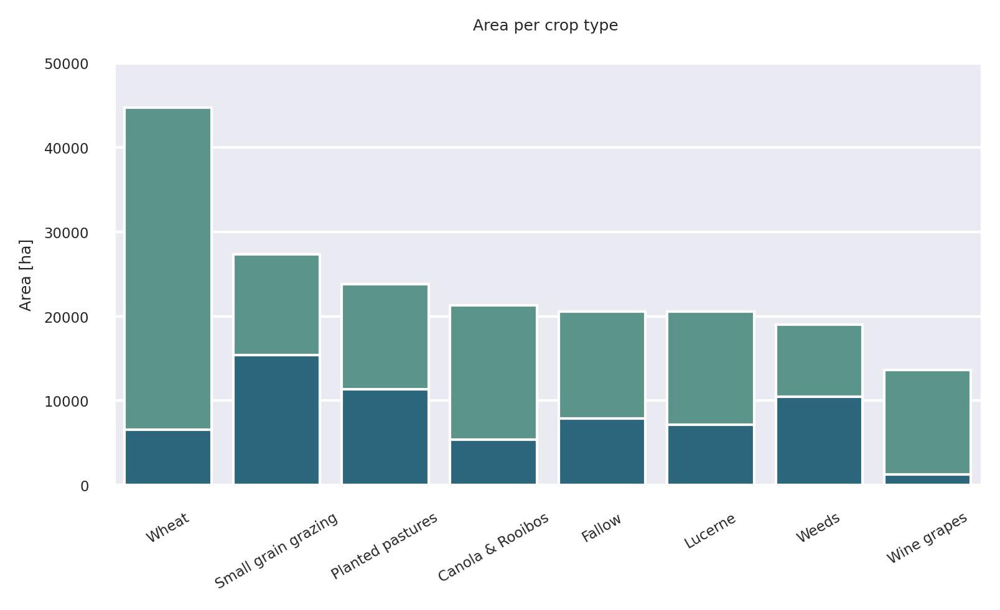

# Radiant Earth Spot the Crop Challenge

In this project we work on the Zindi challenge: ["Radiant Earth Spot the Crop Challenge"](https://zindi.africa/competitions/radiant-earth-spot-the-crop-challenge/data).

The background of the project:

- "The agricultural sector makes a substantial contribution to GDP and livelihoods across the developing world. However, regular and reliable agricultural data remains difficult and expensive to collect on the ground. As a result, policy-makers usually don’t have access to updated data for implementing policies or supporting farmers." 

- "Earth observation satellites provide a wealth of multi-spectral image data that can be used for developing agricultural monitoring tools. These tools support farmers and policy-makers across Africa and the developing world."

- The dataset was generated by the [Radiant Earth Foundation](https://www.radiant.earth/) team, using the ground reference data collected and provided by the Western Cape Department of Agriculture.

The objective of the project:

- The objective of this challenge is therefore to classify crops in the Western Cape of South Africa using time series of Sentinel-2 multi-spectral data. Our goal was to build a machine learning model to predict the crop type classes for dataset. 

The goals of the project:

- For our project we set three different goals:
    
    * The accurate census provides valuable information for the farmers community. Thus we want to achieve a **high accuracy on each crop type**.

    * Using helicopters for mapping agriculture lang usage is expensive and time consuming. Based on our research we estimate the cost for mapping to be $1,000,000 and it takes 25 working days to map this area. Our goal is to **reduce the cost (money & time) for agricultural census**.

    * The entire mapping process takes 16 weeks. But Sentinel2-Data overflies the area of interest every 3 - 10 days. The temporal resolution can be improved. Thus we want to provide a model to create a **census for each month**.

---
## The Team

Anitha Grace Uwinema: 
- I studied Water and Environmental Engineering and I am looking into becoming a data scientist.
- Find me on [GitHub](https://github.com/uwinema), [LinkedIn](https://www.linkedin.com/in/anitha-grace-uwinema-17b348240/)

Felix Behrendt:
- I studied Geoinformatics and love to gain more professional experience in data science.
- Find me on [GitHub](https://github.com/Fbehr-data), [LinkedIn](https://www.linkedin.com/in/felix-behrendt-3b4ba1237/)

Max Langer: 
- I am a biologist and highly motivated to build a career in data science, as working with data and code is my passion.
- Find me on: [GitHub](https://github.com/langer-net), [LinkedIn](https://www.linkedin.com/in/max-langer-798903127/)

Picasso

Timo Fischer

---
## Data Structure
For this project we use 6 of the 12 available spectral bands and the cloud mask of the Sentinel-2 data set. Information on the Sentinel-2 is available [here](https://de.wikipedia.org/wiki/Sentinel-2). 
- Each band consists of 2650 individual tiles (TIF-files), each with a size of 256 x 256 pixels, which corresponds to an area of 2560 m x 2560 m. 
- This means that we have all band information for each unique tile.
- Each of these unique tiles contains a certain amount of fields. 
- Each field has a unique ID and a unique label that identifies the crop type in the field. 

---
## Requirements and Setup:
### Requirements:

- [pyenv](https://github.com/pyenv/pyenv) with Python: 3.9.8
- [Poetry](https://python-poetry.org/): 1.1.13 or higher

### Setup

For setting up the `virtual environment` we used `Poetry`.
So after downloading the repository run the following code in your terminal:

```BASH
pyenv local 3.9.8
python -m venv .venv
source .venv/bin/activate
pip install --upgrade pip
poetry install
```

This will setup the virtual environment in a `.venv` folder and install all needed packages listed in the `pyproject.toml`. 

### Activate the environment

For activating your virtual environment when restarting the session use the following command:

```BASH
source .venv/bin/activate
```

---
## Downloading and Preprocessing the Data
### Downloading the data
The data is downloaded from the Radiant Earth Foundation servers. This requires the package `radiant-mlhub` in exactly `version 0.1.3`. This package should have already been installed by Poetry. Downloading and extracting may take a while (**about 2 - 5 hours**) depending on your internet connection.
You can start the download by typing the following in the terminal, while `being in the repository-folder`:

```BASH
python preprocessing.py download
```
### Preprocessing the data
The preprocessing scripts also take their time. In the `first preprocessing step`, we convert the image information from the TIF-files to NumPy arrays and save one array per field in the .npz format. This step takes another **1 - 3 hours** depending on the processor power of your PC. You can start the conversion by:

```BASH
python preprocessing.py convert
```

In the `second preprocessing step`, we calculate the mean of for each band of each field for each date. This results in a CSV-file that can be used for further feature engineering. The second preprocessing step is started by:

```BASH
python preprocessing.py download
```

---
## Feature engineering / Data cleaning, Train-Test-Split and Resampling
### Feature engineering / Data cleaning


```BASH
python feature_engineering.py
```

#### **cloud-masking**
For each tile and each timestamp a cloudmask (CLM) was provided. In case of clouds we don't measure field data, but the upper site of a cloud. To each field and timestamp the mode of cloudmask will be calculated and added to the data (during preprocessing). Thus results in two different values:
</br> 
* 0 - no cloud 
* 255 - no information

Currently our package provides two solution. The first option is to keep all the information delete all observations with no cloud information. See this [Notebook](https://github.com/Fbehr-data/Radiant-Earth-Spot-Crop/blob/main/notebooks/feature_engineering_01_cloudmask.ipynb) for more information. <br> 
#### **Spectral Indices**
In the field of remote sensing the actual bands are used to calculate spectral indices. These indices represent different information about the measured object. For example: The Normalized Difference Vegetation Index (NDVI) which is an indicator of the vitality of vegetation. A full list of indices can be found [here](https://www.indexdatabase.de/db/is.php?sensor_id=96). We calculate these indices based on the [EDA](https://github.com/Fbehr-data/Radiant-Earth-Spot-Crop/blob/main/notebooks/EDA_spectral_indices.ipynb).
- NDVI
- WET
- PVR 
- VARI_green
- MNSI
- NDRE
- GARI<br>

#### **Texture Indices**
It is proven that textural metrics can be used on remote sensing image to classifify different crop types. These metrics represent the texture of a field, as somebody can imagine a winegrape-field has a different texture than an wheat field. A famous approach are the metrics from the Grey-Level-Co-Occurence Matrix (GLCM). A list of the most common indices can be found [here](https://rstudio-pubs-static.s3.amazonaws.com/536921_af2c31c083544a3a9588da9c86692636.html).

We calculate these indices:
- Homogeneity
- Contrast
- Correlation

#### **Mean per Month and Feature-Time-Confusion** 
We calculate for each field the mean values of each feature and transform the the date column / months column and combine it to the features.

|Field ID | Month      | Feature     |
|-------- | -----------| ----------- | 
|1        | 4          | 0.4         |
|1        | 5          | 0.7         |

to


|Field ID | Feature of Month 4  | Feature of Month 5 |
|-------- | -----------| ----------- | 
|1        | 0.4        | 0.7         |

### Train-Test-Split
Splitting our dataset is essential for an unbiased evaluation of prediction performance. We randomly split our dataset into 3 subset:
- Training set : is applied to train, or fit, the model
- Validation set : is used for unbiased model evaluation during hyperparameter tuning
- Test set: is needed for an unbiased evaluation of the final model.
Now, in order to do that we need first to import the train_test_split function that we created, like this:

```BASH
from train_test_function import train_test_split_fields
```

the split is done by that function, we only set the train_size as the test_size will adjust accordingly. We also set the random_state to 42.

### Resampling
In the training set we have skewed class proportions. In order to solve the imbalanced classification problem, we are first going to combine class 8 and 9 into one class. Then we do the resampling using 2 techniques: downsampling the majority classes and upweighting the minority classes using RandomUnderSampler and RandomOverSampler from the imblearn library. For more details check Dataset in this [notebook](https://github.com/Fbehr-data/Radiant-Earth-Spot-Crop/blob/main/notebooks/Resampling_crop_type.ipynb).

---
## Modelling
Classification problems are supervised learning problems where the training dataset consists of data composed of independent features and of the dependent targets (labels or classes). The classification models are trained using different algorithms. For our task, we tried common algorithms that can be used for multi-class classification such as:

* KNN  
* XGBoost 
* RandomForest 
* ANN 
* Extra RandomForest 

The modelling can be started by typing the following in the terminal, while `being in the repository-folder`:

```BASH
python modelling.py
```

---
## Results and Conclusion
### Evaluation metric
For the evaluation metric, we chose the `F1-score` as metric, since the main goal is to correctly identify the crop type (class) of as many fields as possible. Neither false-positive (FP) nor false-negative (FN) miss-classifications are particularly good or bad, hence the harmonic mean F1. 

### Model performance
For the baseline model we chose a K-Nearest Neighbors (KNN) model, as this is a simple algorithm, which is based on the assumption that similar classes will be in close proximity of each other. It can be used for both binary and multiclass classifications and is very fast and easy to implement, especially for large data sets [source](https://towardsdatascience.com/multiclass-classification-using-k-nearest-neighbours-ca5281a9ef76).

Decision tree ensemble methods were chosen for the more advanced models. They performed well compared to neural networks and KNN. For the F1 score, values of 0.42 were obtained for the baseline model (KNN) on the test data, while the [extremely randomized tree](https://scikit-learn.org/stable/modules/generated/sklearn.ensemble.ExtraTreesClassifier.html) and the [XGBClassifier](https://xgboost.readthedocs.io/en/stable/#) performed better with values between 0.59 and 0.61 on the test data.

However, all models showed overfitting on the training data, implying that they do not generalize very well and could be further improved by more rigorous regularization. Since the XGBClassifier performed best (highest F1 score and lowest overfitting), the error analysis is performed using the results/predictions of this model.  



### Error analysis
When analyzing the errors of the XGBClassifier, we find only a few particularly noticeable misclassifications for certain crop types. These are the entries outside the diagonal of correctly classified crops. We note that `Weeds`are often misclassified as `Fallow` and vice versa. The remaining misclassifications are distributed rather stochatically, which is a good sign that our modeling approach does not contain systematic errors.

 

Looking at the accuracy with which the individual crop types (classes) are rightly classified, large differences become apparent. The classes `Wine grapes` and `wheat` show a relatively high accuracy (80-90%), while the other classes are not predicted very accurately (below 60-70%). One reason for this result is probably that grapes and wheat have very characteristic textures and colors, while the rest of the crops are quite similar in this aspect. 


We also took a look at the area covered by the fields of each crop type. In the graph, only the test data (1/3 of the whole dataset) are shown, but they are representative of the whole dataset. 

We see that `Wheat` covers the largest area and `Wine grapes` cover the smallest area compared to the other crop types. In addition, the lowest amounts of misclassified areas (in percentage) are in the `Wheat` (14% missclassified area) and `Wine grapes` (9% missclassified area) classes. In the other classes, the percentages of misclassified areas range from 25 to 56%. 



This result together with the high accuracy shows us that we can use the model successfully in `Wheat` and `Wine grapes`. While it still needs to be improved for the classification of the other crop types. If we add up the money that can be saved from correctly classified wheat area by using our model compared to the manual agricultural census, we come up with savings of $210,000. We also save an additional $60,000 for the correctly classified wine grapes area.

### Conclusion

* Goal 1: **high accuracy on each crop type**.

A high accuracy prediction is only available for two of eight crop types (wheat, wine grapes)

* Goal 2: **reduce the cost (money & time) for agricultural census**.

Many areas have the same crop types. Therefore, wine regions and wheat fields can be excluded from mapping. A reduction of cost will be around $270,000 and our model needs only a few hours instead of multiple days. 


* Goal 3: **census for each month**.

Based on our model a monthly census is not achievable, because the performance (accuracy) drops a lot. Our model needs the data of the entire growing season for the prediction.


